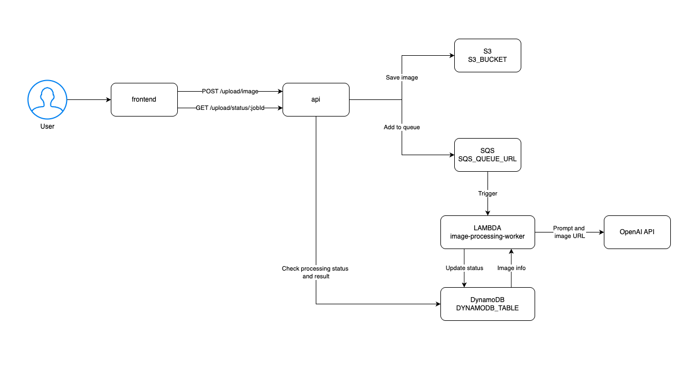

# AI Image Describer System

## Overview

This system allows users to upload images via a React frontend, which are then processed to generate descriptive captions using OpenAI's API. The backend API handles image uploads, stores images in AWS S3, triggers an AWS Lambda worker via SQS for image processing, and saves results in DynamoDB. The frontend shows the image description to the user after image is processed.

---

## System Architecture

1. **Frontend**  
   - React app where users upload images.  
   - Sends images to the backend API.  
   - Polls the backend status endpoint to get processing updates.

2. **Backend API (ECS)**  
   - Dockerized Node.js API.  
   - Handles image uploads, saves images to S3, and pushes messages to SQS queue.  
   - Provides a status endpoint for the frontend to check processing status.

3. **Image Processing Worker (AWS Lambda)**  
   - Triggered by SQS messages.  
   - Downloads image from S3.  
   - Sends image to OpenAI API for description.  
   - Stores description and status in DynamoDB.

---

## Project Structure

### API (Backend)
```
api/
├── Dockerfile
├── src/
│   ├── controllers/
│   │   ├── statusController.js
│   │   └── uploadController.js
│   ├── routes/
│   │   └── uploadRoutes.js
│   ├── services/
│   │   ├── dynamoService.js
│   │   ├── s3Service.js
│   │   └── sqsService.js
│   ├── utils/
│   │   └── multerConfig.js
│   └── index.js
```

### Image Processing Worker (Lambda)
```
image-processing-worker/
└── src/
    ├── handlers/
    │   └── processImage.js
    ├── utils/
    │   └── dynamoService.js
    ├── vision/
    │   └── openai.js
    └── index.js
```

## Environment Variables

### API

| Variable            | Description                         |
|---------------------|-----------------------------------|
| NODE_ENV            | Node environment (development/production) |
| AWS_ACCESS_KEY_ID   | AWS access key ID                  |
| AWS_SECRET_ACCESS_KEY | AWS secret access key             |
| AWS_REGION          | AWS region (e.g., us-east-1)      |
| S3_BUCKET           | S3 bucket name to store images    |
| PORT                | Port to run the backend API       |
| SQS_QUEUE_URL       | URL of the SQS queue              |
| DYNAMODB_TABLE      | DynamoDB table name for storing image data and status |
| FRONTEND_ORIGIN     | Allowed origin for CORS            |

### Image Processing Worker (Lambda)

| Variable         | Description                      |
|------------------|--------------------------------|
| OPENAI_API_KEY   | API key for OpenAI              |
| DYNAMODB_TABLE   | DynamoDB table name             |

### Frontend

| Variable         | Description                      |
|------------------|--------------------------------|
| VITE_UPLOAD_URL  | URL of backend upload endpoint  |
| VITE_STATUS_URL  | URL of backend status endpoint  |

## How It Works

1. User uploads an image via the React frontend.
2. Frontend sends the image to the backend API.
3. API uploads the image to S3 and sends a message to the SQS queue.
4. The image-processing-worker Lambda function is triggered by the SQS queue.
5. Lambda downloads the image from S3, sends it to OpenAI API for description.
6. The description and processing status are saved to DynamoDB.
7. Frontend polls the status endpoint until processing completes.
8. The description is displayed to the user once ready.

## System Architecture



## Frontend Preview


